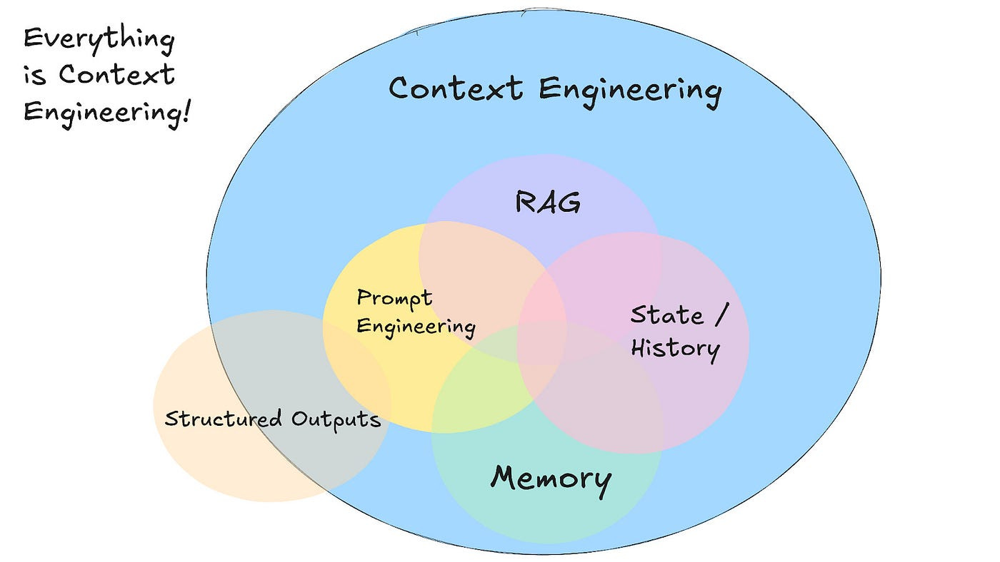

# Del retrieval a la respuesta

## Objetivos

- Entender qué aporta la capa de generación respecto al retriever.
- Definir el contrato `responder(pregunta) → dict`.
- Ver el flujo end-to-end de inferencia RAG.

---

## 1) Retrieval ≠ respuesta

El retriever devuelve **fragmentos** ordenados por similitud. Eso **no** es una respuesta para el usuario final: son candidatos de evidencia.

| Salida | Para quién | Ejemplo |
|--------|------------|---------|
| Chunks + distance | Desarrollador / depuración | «Fragmento 1 (FAQ): GRATUITO=1 significa…» |
| Respuesta redactada | Usuario final | «Según la FAQ, el campo GRATUITO vale 1 si el evento es gratuito y 0 si no lo es.» |

La generación **sintetiza** esos fragmentos en lenguaje natural, respetando (idealmente) el corpus.

Error frecuente: mostrar al usuario el contexto crudo y llamar a eso «chatbot». El RAG completo **redacta**.

---

## 2) Flujo completo

```text
Pregunta
   ↓
Retriever (embed + Chroma)     ← Sprint 9
   ↓
Contexto formateado            ← context.py
   ↓
Prompt (instrucciones + contexto + pregunta)
   ↓
LLM (Gemini)
   ↓
Respuesta (+ fuentes)
```

En código, ese flujo se encapsula en una sola función. Ejemplo de la llamada a la función principal de tu RAG.

```python
resultado = responder("¿Hay cine gratuito en verano?")
# resultado["respuesta"]  → texto para el usuario
# resultado["fuentes"]    → archivos citados
# resultado["contexto"]   → para depurar
# resultado["error"]      → None o mensaje
```

La interfaz de usuario o cualquier módulo de entrada deben simplemente llamar a la función principal encargada de responder; no deben reimplementar la lógica de recuperación o generación.

---

## 3) Analogía con Sprint 5

En Prompt & Context Engineering ya montaste un asistente:

```text
S5 (manual)                    RAG (automático)
───────────                    ────────────────
consulta                       consulta
   │                              │
   ▼                              ▼
seleccionar_faq()              retriever (embeddings)
   │                              │
   ▼                              ▼
build_chat_prompt()            build_rag_prompt()
   │                              │
   ▼                              ▼
Gemini                         Gemini
```

La diferencia no es el LLM final: es **cómo eliges el contexto**. Keywords + FAQ fija → **recuperación semántica** sobre muchos chunks. En este caso, el contexto es el resultado de la recuperación semántica sobre muchos chunks.



---

## 4) Anti-patrones

| Anti-patrón | Problema |
|-------------|----------|
| Mezclar las etapas de recuperación y generación en un solo bloque sin modularidad | Dificulta la depuración y la reutilización |
| Usar el contexto sin instrucciones claras | Riesgo de respuestas poco fundamentadas o alucinaciones |
| Ignorar las fuentes o referencias en los metadatos | No se puede rastrear la procedencia de la información |
| Incrustar toda la lógica del pipeline directamente en la interfaz | Duplica lógica y dificulta el mantenimiento |

---

## Resumen

- El retrieval selecciona evidencia; la generación **redacta**.
- El contrato del backend es `responder(pregunta)`.
- Misma idea que S5, con contexto recuperado automáticamente.
- Es importante modularizar el pipeline de RAG para facilitar la depuración y la reutilización.
- Es importante que la interfaz de usuario o cualquier módulo de entrada simplemente llame a la función principal encargada de responder; no reimplementen la lógica de recuperación o generación.